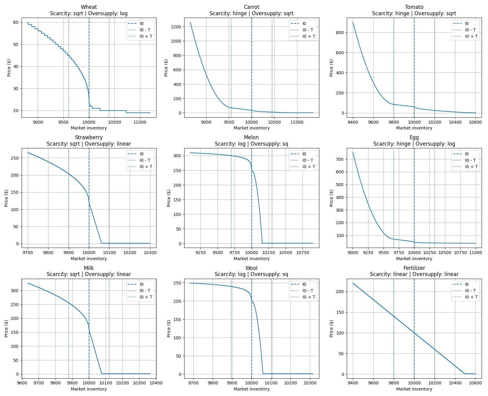

# Kaggriculture — Game Mechanics Reference

Quick reference for the main mechanics, costs, production rates, market behavior, and constraints useful for agent development.

---

## 1. Production

For crops, **Yield / Tile / Day** is the total units harvested divided by the number of days the tile is occupied, assuming daily watering and harvesting at peak yield.

For animals, it is the steady-state production rate (`1 / interval`) after the first yield. Animals continue producing as long as they survive.

For animals, **Max Yield** corresponds to `max_held`, the maximum unharvested product that can accumulate on the tile.

| Type             | Yield Type | Cost | Base Price | First Yield | Max Yield Age | Subsequent Yields         |          Max Yield |         Action Cost | Yield / Tile / Day |
| ---------------- | ---------- | ---: | ---------: | ----------: | ------------: | ------------------------- | -----------------: | ------------------: | -----------------: |
| **Wheat**        | One-time   |   10 |         25 |      2 days |        4 days | None                      | 6 (4 unfertilized) |                   1 |               0.80 |
| **Carrot**       | One-time   |   20 |         35 |      2 days |        3 days | None                      | 4 (3 unfertilized) |                   1 |               0.75 |
| **Tomato**       | Ongoing    |   50 |         60 |      8 days |       11 days | Every day ×4              |                  4 |                   1 |               0.33 |
| **Strawberry**   | Ongoing    |  100 |        120 |     10 days |       16 days | Every other day ×4        |                  4 |                   1 |               0.24 |
| **Melon**        | One-time   |   80 |        250 |     10 days |       10 days | None                      |                  6 |                   1 |               0.55 |
| **Goose / Egg**  | Ongoing    |  300 |         50 |      4 days |           N/A | Every day indefinitely    |             4 held |    1 + 1 build coop |               1.00 |
| **Cow / Milk**   | Ongoing    |  400 |        160 |      8 days |           N/A | Every 2 days indefinitely |             6 held | 1 + 1 build pasture |               0.50 |
| **Sheep / Wool** | Ongoing    |  500 |        200 |      6 days |           N/A | Every 3 days indefinitely |             6 held | 1 + 1 build pasture |               0.33 |
| **Fertilizer**   | N/A        |  100 |          X |         N/A |           N/A | N/A                       |                N/A |                   1 |                N/A |

### Crop Specifics

* **Wheat:** maximum yield 4 without fertilizer, 6 with fertilizer.
* **Carrot:** maximum yield 3 without fertilizer, 4 with fertilizer.
* **Melon:** bonus window ages 6–12. Maximum yield 6 at age 10 without fertilizer or age 8 with fertilizer.
* **Tomato:** 4 scheduled yields at ages 8, 9, 10 and 11, then eventually decays into a weed.
* **Strawberry:** 4 scheduled yields at ages 10, 12, 14 and 16, then eventually decays into a weed.

Plants must be watered every day. Two successive days without water turn a plant into a **weed**.

A newly planted seed starts with one missed watering day already counted, so it must be watered on the planting day or it becomes a weed at the end of that day.

---

## 2. Animals

Animals must be fed with **Wheat**.

Two successive days without food cause the animal to escape permanently.

Wheat can be produced on the farm or purchased from the market at its current price.

### Animal Care

Care banks a bonus for the next scheduled production.

* A day where an animal is both fed and cared for adds **+1** to its pending care bonus.
* On the next scheduled production, a fed animal produces its base yield plus the accumulated bonus.
* The bonus is then reset to 0.
* If the animal is not fed on its production day, the base unit is produced but the accumulated bonus is lost.
* Production remains limited by `max_held`.

### Fertilizer Production

Every surviving animal makes **1 fertilizer available per day**.

Uncollected fertilizer does **not accumulate**.

---

## 3. Fertilizer

Fertilizer can be produced by animals or purchased from the market.

Important crop effects:

| Crop       | Without Fertilizer | With Fertilizer |
| ---------- | ------------------ | --------------- |
| **Wheat**  | Max 4              | Max 6           |
| **Carrot** | Max 3              | Max 4           |
| **Melon**  | Max 6 at age 10    | Max 6 at age 8  |

---

## 4. Farm Infrastructure

### Land

The farm is divided into 5×5 segments.

Additional segments cost:

| Expansion |       Cost |
| --------- | ---------: |
| 1st       | **$1,000** |
| 2nd       | **$2,000** |
| 3rd       | **$4,000** |
| **Total** | **$7,000** |

### Shed

Maximum capacity: **100 non-seed items**.

Seeds do not count toward this limit.

---

## 5. Farm Hands

Farm hands are temporary workers hired for a single day.

Their cost follows the Fibonacci sequence:

`cost = farmHandCostMult × fib(n)`

where `n` is the number of farm hands already hired during the current day.

With the default `farmHandCostMult = 1`:

| Farm Hand |   Cost |
| --------: | -----: |
|       1st |  **1** |
|       2nd |  **1** |
|       3rd |  **2** |
|       4th |  **3** |
|       5th |  **5** |
|       6th |  **8** |
|       7th | **13** |
|       8th | **21** |
|       9th | **34** |
|      10th | **55** |

The hiring cost sequence **resets at the start of each day**.

---

## 6. Town Shops

New shop instances unlock every **3 days**, with replacement, up to **8 active instances**.

Each shop instance consumes its demanded products every **4 turns**, equivalent to **6 units per product per day**. Single-product shops marked ×2 consume **12 units per day**.

| Shop Type | Increases Demand For |
| --- | --- |
| **Bakery** | Eggs, Wheat |
| **Pizza Shop** | Milk, Tomatoes, Wheat |
| **Brunch Spot** | Eggs, Wheat, Strawberries |
| **Yarn Store** | Wool ×2 |
| **Ice Cream Shop** | Strawberries, Milk, Wheat |
| **Pet Cafe** | Carrots ×2 |
| **Smoothie Shop** | Strawberries, Milk |
| **Farmers Market** | Wheat, Carrots, Tomatoes, Strawberries |

Multiple instances of the same shop stack their demand.

---

## 7. Market Prices

For the complete price calculation and market curve definitions, see the [Price Function](game_rules.md#the-price-function)

### Market Inventory

`inventory` represents the **global market stock of a resource**, not the amount stored on a player's farm.

Market inventory evolves as products enter or leave the market:

* Products sold by players **increase** market inventory.
* Products bought from the market **decrease** market inventory.
* Town Shop consumption **decreases** market inventory.
* Market inventory persists throughout the game.

General behavior:

* `inventory < I0` → scarcity → **price increases**
* `inventory = I0` → equilibrium → **base price**
* `inventory > I0` → oversupply → **price decreases**
* Minimum market price → **$1**

The further inventory moves from `I0`, the more the price changes according to the resource's specific market curve.

### Market Behavior Summary

| Resource       | Scarcity                          | Oversupply              | Key Behavior                      |
| -------------- | --------------------------------- | ----------------------- | --------------------------------- |
| **Wheat**      | Fast initial increase             | Slow decrease           | Resistant to oversupply           |
| **Carrot**     | Accelerates under strong scarcity | Fast decrease           | Strong scarcity potential         |
| **Tomato**     | Accelerates under strong scarcity | Fast decrease           | Strong scarcity potential         |
| **Strawberry** | Fast increase                     | Very fast decrease      | Highly sensitive to oversupply    |
| **Melon**      | Slow increase                     | Extremely fast decrease | Extremely sensitive to oversupply |
| **Egg**        | Accelerates under strong scarcity | Slow decrease           | Resistant to oversupply           |
| **Milk**       | Fast increase                     | Very fast decrease      | Highly sensitive to oversupply    |
| **Wool**       | Slow increase                     | Extremely fast decrease | Extremely sensitive to oversupply |
| **Fertilizer** | Regular increase                  | Regular decrease        | Predictable                       |

For **Carrot, Tomato and Egg**, prices can accelerate sharply when market scarcity becomes significant.

For **Strawberry, Melon, Milk and Wool**, oversupply can rapidly push the market price toward the **$1 floor**.

### Market Price Curves

---

## 8. Key Constraints

| Mechanic              | Constraint                                                           |
| --------------------- | -------------------------------------------------------------------- |
| **Plants**            | Two successive days without water → weed                             |
| **Animals**           | Two successive days without Wheat → permanently lost                 |
| **Animal fertilizer** | 1 available per surviving animal per day; does not accumulate        |
| **Animal care**       | Fed + cared days accumulate bonus for the next production            |
| **Animal production** | Unharvested production limited by `max_held`                         |
| **Shed**              | Maximum 100 non-seed items                                           |
| **Land**              | Expansions cost $1,000 → $2,000 → $4,000                             |
| **Premium products**  | Strawberry, Melon, Milk and Wool are highly vulnerable to oversupply |
| **Hinge products**    | Carrot, Tomato and Egg can rise sharply under strong scarcity        |
| **Town shops**        | Shop composition directly changes demand                             |
